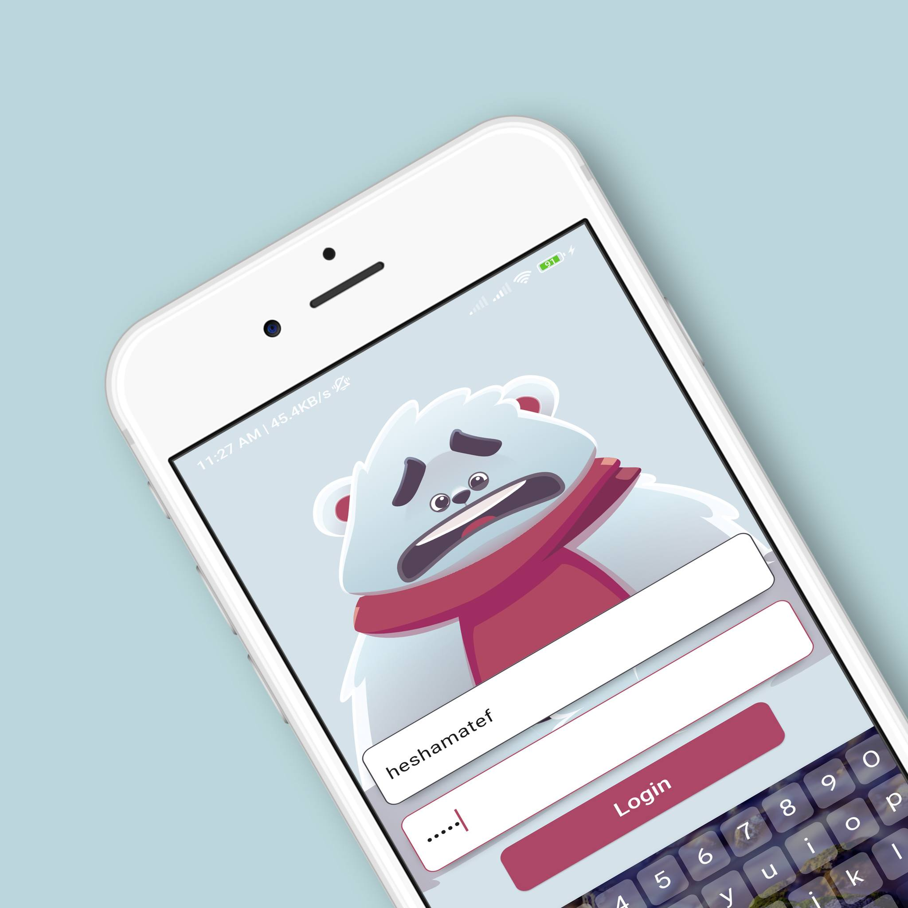
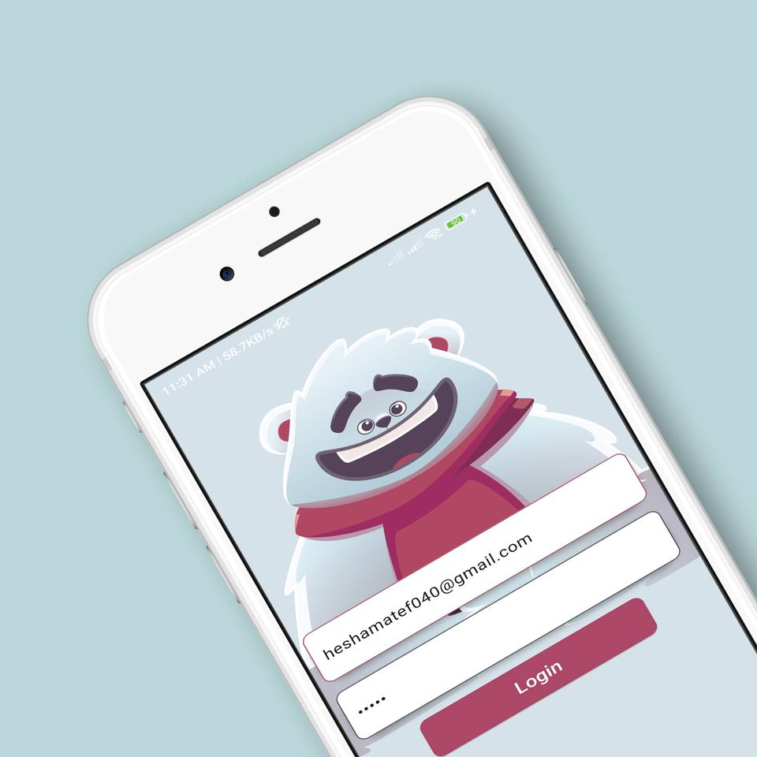
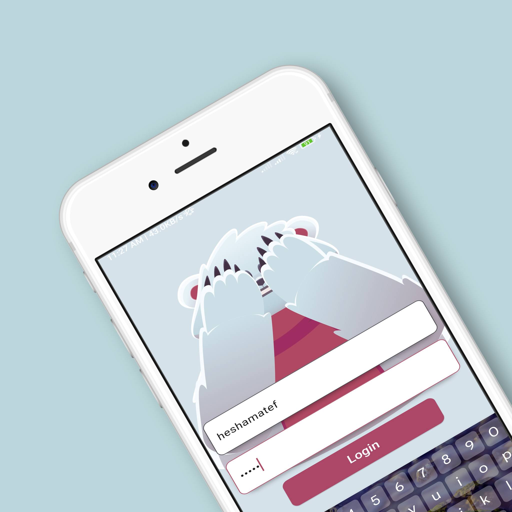

# Flutter Login Screen with Rive Animation

This Flutter project demonstrates a login screen with an animated Rive illustration. The login screen includes features such as eye movement and hand gestures.

## Preview

.jpg)

## How to Use

1. Clone the repository.
2. Open the project in Flutter.
3. Run the application on your device or emulator.

## Features

- Animated login screen.
- Eye movement and hand gestures.
- Login validation.

## Usage

Feel free to use this code as a template for your Flutter projects. If you find any issues or have suggestions for improvement, please open an issue or submit a pull request.

## Credits

This project uses the [Rive](https://rive.app/) library for animation.

## License

This project is licensed under the MIT License - see the [LICENSE](LICENSE) file for details.
